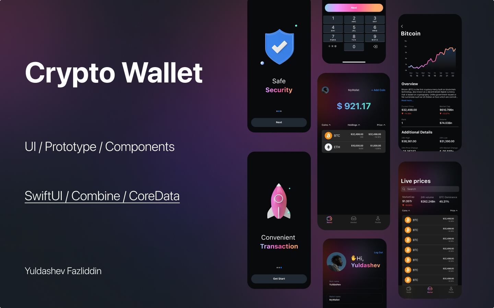

# Crypto Wallet App

## Description
Crypto Wallet is an iOS app for managing cryptocurrencies. It allows you to add coins to your portfolio and track changes in their prices in real time.


## Architecture
The project follows the MVVM architectural pattern, ensuring scalability and testability.


## Technology
Swift | IOS 18 | SwiftUI | Combine | Core Data


## Functions
- Adding cryptocurrencies to your portfolio
- Display current prices
- Automatic data update
- User-friendly and minimalistic design


## Installation
1. Clone the repository:
   ```sh
   git clone https://github.com/Yuldshev/CryptoWallet
   ```
2. Open the project in Xcode:
   ```sh
   open CryptoWallet.xcodeproj
   ```
3. Run the project on a simulator or device.


## Planned Updates
- Add support for multiple fiat currencies
- Realize price change charts
- Improve user interface


## Figma Design Link
[[Figma design link here]](https://www.figma.com/design/j2nsRSHVoexmr3dkjNdmSq/CryptoWallet?node-id=215-3283&t=32Xm1fNAorGhJuyG-1)
